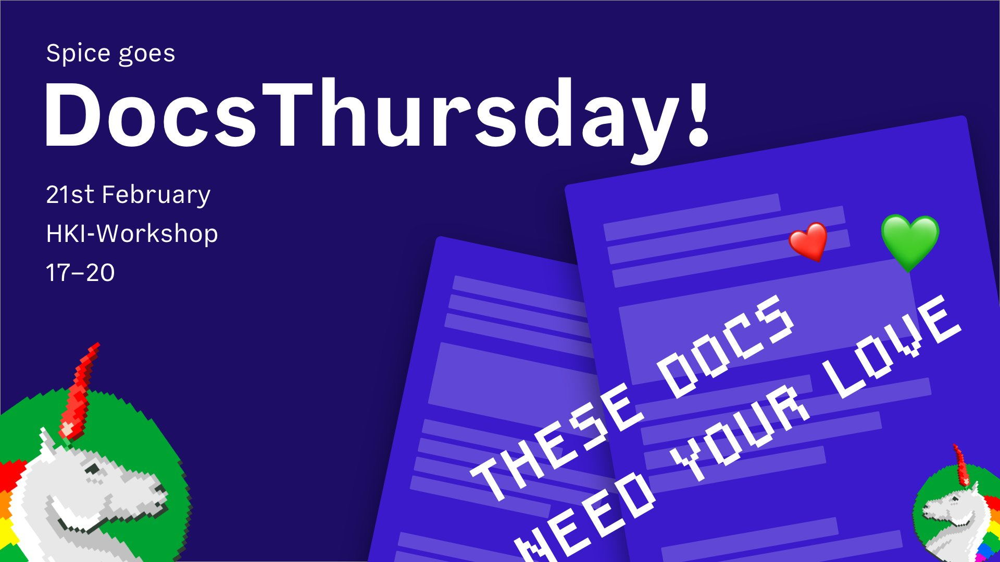

# Docs Thursday Presentation Materials

<!-- START doctoc generated TOC please keep comment here to allow auto update -->
<!-- DON'T EDIT THIS SECTION, INSTEAD RE-RUN doctoc TO UPDATE -->
**Table of Contents**  *generated with [DocToc](https://github.com/thlorenz/doctoc)*

- [Slides](#slides)
- [Resources](#resources)
  - [Beyond the README: Creating Effective Documentation for Your Project by Rand McKinney (21m video)](#beyond-the-readme-creating-effective-documentation-for-your-project-by-rand-mckinney-21m-video)
  - [Loopback Readme Guidelines](#loopback-readme-guidelines)
  - [A Look Into Static Site Generators For Open Source Docs by Carolyn Stransky (24m video)](#a-look-into-static-site-generators-for-open-source-docs-by-carolyn-stransky-24m-video)
  - [he Art of Documentation and Readme.md for Open Source Projects - Ben Hall (35m video)](#he-art-of-documentation-and-readmemd-for-open-source-projects---ben-hall-35m-video)
  - [Write The Docs](#write-the-docs)
  - [How to build a website with github tutorial link video 1h28m - video](#how-to-build-a-website-with-github-tutorial-link-video-1h28m---video)
  - [Write the Readable README by Daniel D. Beck 23m video](#write-the-readable-readme-by-daniel-d-beck-23m-video)
  - [README Checklist by Daniel D. Beck](#readme-checklist-by-daniel-d-beck)
- [Tools](#tools)
  - [Docosaurus](#docosaurus)
  - [tocdoc](#tocdoc)
  - [allcontributors](#allcontributors)
  - [docz](#docz)
  - [read the docs + sphinx](#read-the-docs--sphinx)

<!-- END doctoc generated TOC please keep comment here to allow auto update -->

## Slides

- [Text Only Version](media/docs-thursday.md)
- [PDF Version](media/docs-thursday.pdf)
- [JPG Slides](media/presentation)

## Resources

### [Beyond the README: Creating Effective Documentation for Your Project by Rand McKinney](https://www.youtube.com/watch?v=NwUWuD9Idv4) (21m video)

With 25 years of experience writting developer documentation, McKinney provides motivation, strategies, and practical applications for writting developer documentation. He introduces the 2 audiences for developer documentation: contributors and users with an emphasis on the latter.

### [Loopback Readme Guidelines](https://loopback.io/doc/en/contrib/README-guidelines.html)

Altough this might be a bit to verbose for starter documenation, as it perhaps focuses on contributors, it has some great advice about what should be in a readme file and how it should be formatted.

### [A Look Into Static Site Generators For Open Source Docs by Carolyn Stransky](https://www.youtube.com/watch?v=_2hbcnEIqrA&t=20s) (24m video)

A review of 46 polled open source projects, from small home-grown to very large projects. Some key takeaways are most projects are concerned with conributor experinence, the community of the static site gen, and automation. Interesting was that language was not a preference but rather having a less steep learning curve was key. Most projects interviewed cited that they were happiest when using a variety of tools that fit their specific needs.

### [he Art of Documentation and Readme.md for Open Source Projects - Ben Hall](https://www.youtube.com/watch?v=-EaJEnFhwjs&t=5s) (35m video)

TODO: write summary

### [Write The Docs](https://www.writethedocs.org)

Podcasts, Confrences, Slack Community of Techinical Writers. A huge amount of resources.

### [How to build a website with github tutorial](https://github.com/mapzen/write-the-docs-tutorial) [link video](https://www.youtube.com/watch?v=812E14gFgb4) 1h28m - video

If you are not a developer, this provides a good walkthrough for setting up github pages / jekyll. Video and demo are targeted towards Technical Writers at the Write The Docs conference.

### [Write the Readable README by Daniel D. Beck](https://www.youtube.com/watch?v=2dAK42B7qtw) 23m video

In this video Beck did a survey of over 200 public opensource readme files from projects with over 10k stars on github, projects he was familair with, and some closed source readmes. Bias is towards established popular products.

### [README Checklist by Daniel D. Beck](https://github.com/ddbeck/readme-checklist/blob/master/checklist.md)

A series of the 4 ways to build confidence in your users from a readme, described in the talk Write the Readible Readme, that you can easily go through to evaluate your current readme and where it could use some love.

## Tools

### [Docosaurus](http://docosaurus.io)

Created by the Facebook Opensource Team to create a simple way to document projects.

### [tocdoc](https://www.npmjs.com/package/doctoc)

Generates a Table Of Contents for markdown files automagically. Important flag: --github

### [allcontributors](https://allcontributors.org/)

A tool that will automatically add all of the contributors from a file to your project readme file.

### [docz](https://www.docz.site)

Great project for documenting react projects with mdx. Also a great example of good documentation.

### [read the docs + sphinx](readthedocs.io)

A free but add supported way to automatically build and host your docs. You can use standard markdown files in a docs directory and you will need to use python to configure initilaly.
